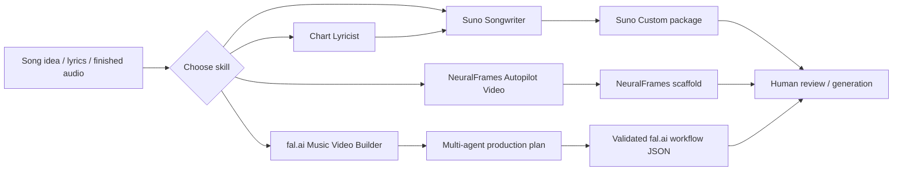

<p align="center">
  
</p>

<h1 align="center">Suno Agent Production Suite</h1>

<p align="center">
  <strong>OpenAI Codex skills for Suno songwriting, chart-caliber lyric development, NeuralFrames music-video scaffolding, and budget-aware fal.ai video production.</strong>
</p>

<p align="center">
  
  
  
  
</p>

## What is the Suno Agent Production Suite?

**Suno Agent Production Suite** is a four-skill AI music production toolkit for OpenAI Codex-style agents. It turns a song idea into a structured **Suno Custom song package**, strengthens lyrics with a rigorous **anti-cliche songwriting workflow**, builds a review-ready **NeuralFrames Autopilot music-video scaffold**, and designs a **budgeted multi-agent fal.ai workflow** for a complete music video.

It is built for creators, songwriters, producers, prompt engineers, AI-music developers, and music-video makers who want repeatable production contracts instead of vague “make it cinematic” prompting.

> **Short answer:** this repository gives an AI agent specialized operating procedures, reference material, and validation scripts for writing better Suno songs and turning finished music into coherent AI-generated music-video workflows.

## Skills at a glance

| Skill | Agent | Best for | Core output |
|---|---|---|---|
| [`suno-music`](skills/suno-music/) | **Suno Songwriter** | Original Suno songs, Custom Mode prompting, tagged lyrics, generation controls | Six-field Suno song package + optional browser population |
| [`chart-lyricist`](skills/chart-lyricist/) | **Chart Lyricist** | Rewriting weak/generic lyrics, improving hooks, prosody, specificity, structure | Production direction + performance-ready tagged lyrics |
| [`neuralframes-autopilot-video`](skills/neuralframes-autopilot-video/) | **NeuralFrames Autopilot Video** | Converting a finished song into a cinematic NeuralFrames setup | Configured music-video scaffold ready for human review/generation |
| [`fal-music-video-builder`](skills/fal-music-video-builder/) | **fal.ai Music Video Builder** | Full-song, budget-controlled, multi-agent AI music-video production | Validated production plan + importable fal.ai workflow JSON |

## Why this toolkit is different

Most AI music workflows stop at a single prompt. This project treats songwriting and music-video generation as **production systems**:

- **Exact contracts instead of loose prompting** — field limits, timing rules, continuity requirements, and validation steps are explicit.
- **Originality controls** — the lyric skill rejects stock AI imagery, generic hooks, filler, and artist imitation.
- **Music-aware direction** — prompts describe rhythm, harmony, instrumentation, vocal behavior, arrangement, mix, and section-level energy.
- **Human approval before paid generation** — browser-assisted skills prepare the work but stop before credit-consuming actions unless the user explicitly authorizes them.
- **Budget-aware video design** — the fal.ai workflow reserves retry budget, verifies live model schemas/pricing, and proves timeline coverage.
- **Continuity as a first-class constraint** — characters, wardrobe, props, locations, palette, lenses, and visual rules are tracked across shots.
- **Validation utilities included** — Python scripts check Suno package limits, audio duration, lyric quality, and fal.ai workflow integrity.

## Architecture



---

# Skill 1: Suno Songwriter

**Agent:** `Suno Songwriter`  
**Skill ID:** `$suno-music`  
**Purpose:** create an original, production-aware song package for Suno Custom Mode and optionally populate the Suno interface through browser automation.

### What the agent produces

Every completed song package contains **exactly six fields**:

1. **Song Title** — concise, original, and earned by the central hook.
2. **Style Description** — exactly **1,000 characters**, one English paragraph, with genre, tempo/feel, rhythm, harmony, instrument roles, vocal identity, energy arc, production, and mix priorities.
3. **Excluded Styles** — a concise negative prompt for unwanted genres, instruments, vocal traits, rhythmic habits, or production defects.
4. **Weirdness** — constrained to `0–80`.
5. **Style Influence** — constrained to `25–100`.
6. **Tagged Lyrics** — a maximum of **5,000 characters**, with section/performance cues on dedicated square-bracket lines.

### Production logic

The skill treats the style field as a compact producer brief rather than a pile of adjectives. It front-loads non-negotiables, assigns jobs to instruments, resolves contradictory tempo/density/space instructions, and treats genre fusion as one dominant musical grammar with carefully chosen guest traits.

### Built-in references

- [`style-syntax.md`](skills/suno-music/references/style-syntax.md) — how to build the exact 1,000-character production brief.
- [`tag-corpus.md`](skills/suno-music/references/tag-corpus.md) — advanced section, vocal, instrument, dynamics, meter, harmony, and sound-design cues.
- [`experimental-fusions.md`](skills/suno-music/references/experimental-fusions.md) — unusual hybrid production recipes and experimental direction.
- [`research-notes.md`](skills/suno-music/references/research-notes.md) — evidence/provenance notes and guidance on treating community claims as hypotheses.
- [`browser-workflow.md`](skills/suno-music/references/browser-workflow.md) — browser-side Suno Custom Mode operating procedure.

### Validation

[`validate_song_package.py`](skills/suno-music/scripts/validate_song_package.py) checks the package contract, including the exact style length and lyric-field limit.

```bash
python3 skills/suno-music/scripts/validate_song_package.py --help
```

### Example requests

```text
Use $suno-music to turn this concept into a complete Suno Custom song package.

Use $suno-music to write an experimental electronic ballad with sparse production and a controlled one-minute arc.

Use $suno-music to preserve these lyrics but redesign the production style and generation controls.
```

---

# Skill 2: Chart Lyricist

**Agent:** `Chart Lyricist`  
**Skill ID:** `$chart-lyricist`  
**Purpose:** write or rigorously revise distinctive, singable, performance-ready lyrics without default AI cliches or imitation of a living artist.

### What makes the lyric workflow rigorous

The agent builds the song around a clear dramatic situation: singer, addressee, desire, obstacle, consequence, point of view, time frame, genre, tempo, and vocal identity. Before drafting, it creates a private sensory bank of concrete nouns, actions, habits, overheard language, locations, and physical consequences.

Each section must **change something**—information, pressure, power, time, point of view, or consequence. Verse two cannot simply restate verse one.

The revision process checks:

- listener clarity;
- singer authenticity;
- editorial economy;
- prosody and production fit;
- hook specificity;
- sensory evidence;
- structural escalation;
- predictable rhyme and filler;
- generic AI-language patterns.

### Anti-cliche standard

The skill explicitly bans several high-frequency AI lyric shortcuts and rejects superficial synonym swaps. Its rule is simple: replace the **generic thought**, not merely the generic noun.

### Built-in references

- [`workshop-craft.md`](skills/chart-lyricist/references/workshop-craft.md) — songwriting craft synthesized from current workshop/practitioner methods.
- [`anti-cliche-standard.md`](skills/chart-lyricist/references/anti-cliche-standard.md) — hard failures and rewrite standards for generic language.
- [`production-tags.md`](skills/chart-lyricist/references/production-tags.md) — audible square-bracket arrangement and performance cues.

### Validation

[`lyric_lint.py`](skills/chart-lyricist/scripts/lyric_lint.py) performs an adversarial lyric lint pass so hard failures are rewritten before delivery.

```bash
python3 skills/chart-lyricist/scripts/lyric_lint.py --help
```

### Example requests

```text
Use $chart-lyricist to rewrite these lyrics so they feel specific, human, and performance-ready.

Use $chart-lyricist to keep the premise but replace every generic image and strengthen the hook.

Use $chart-lyricist to build a slow-burn lyric whose second verse materially changes the story.
```

---

# Skill 3: NeuralFrames Autopilot Video

**Agent:** `NeuralFrames Autopilot Video`  
**Skill ID:** `$neuralframes-autopilot-video`  
**Purpose:** turn a finished song into a cinematic NeuralFrames Autopilot setup configured for review before generation credits are spent.

### What the agent configures

The workflow uses the final song, canonical lyrics, production direction, aspect ratio, and optional approved character image to establish:

- a one-sentence visual thesis;
- a causal three-act arc;
- a recurring protagonist, object, location, gesture, or metaphor whose meaning evolves;
- one deliberately unusual art-direction or camera rule;
- section-specific escalation tied to musical events;
- continuity for character, wardrobe, props, palette, and location;
- a final image that resolves or complicates the opening image;
- explicit negative constraints for unwanted content or style drift.

### Browser-assisted behavior

The skill can prepare the NeuralFrames Autopilot interface: upload the approved audio, enter the canonical lyrics, set aspect ratio, and configure visual direction. It must stop at the final review boundary before any credit-consuming generation unless the user explicitly authorizes generation.

### Built-in reference

- [`current-ui-notes.md`](skills/neuralframes-autopilot-video/references/current-ui-notes.md) — current operational notes for configuring the NeuralFrames interface.

### Example requests

```text
Use $neuralframes-autopilot-video to turn this finished song into a cinematic video concept and Autopilot setup.

Use $neuralframes-autopilot-video to preserve this approved character image throughout the video and build a coherent three-act visual arc.
```

---

# Skill 4: fal.ai Music Video Builder

**Agent:** `fal.ai Music Video Builder`  
**Skill ID:** `$fal-music-video-builder`  
**Purpose:** design a complete, budget-controlled, continuity-aware AI music-video workflow using specialist agents and current fal.ai model/schema information.

### Core production contract

The skill begins from a finished song, canonical lyrics, hard generation budget, desired resolution/aspect ratio, content limits, and any available character/prop/location references.

It then:

- measures the source audio rather than estimating duration;
- targets a visual timeline of song duration + approximately 3 seconds;
- proves the final timeline lands within **+2 to +5 seconds** of the song;
- holds back **15–20% of budget for retries**;
- verifies current fal.ai endpoint schemas and pricing from live official sources;
- disables native generated audio unless there is a deliberate reason to keep it;
- preserves character, wardrobe, prop, location, and visual-world continuity;
- validates the production plan and workflow JSON before browser import;
- stops before paid generation.

## Multi-agent production pipeline

This skill is intentionally **not** a monolithic “one agent does everything” workflow. The root agent coordinates specialist contracts in dependency waves.

### Wave 1 — meaning and world

| Specialist | Responsibility | Artifact |
|---|---|---|
| **Audio Analyst** | Exact duration, sections, vocal/instrumental passages, tempo/meter estimates, transitions, dynamics, lyrical turns | `song-map.json` |
| **Narrative Architect** | Causal three-act premise, protagonist change, evolving motif, opening/final image relationship, exclusions | `story-bible.json` |
| **Visual-World Designer** | Stable character/wardrobe/prop/location IDs, era, palette, light, lenses, texture, continuity rules | `continuity-bible.json` |

### Wave 2 — edit and economics

| Specialist | Responsibility | Artifact |
|---|---|---|
| **Editorial Scene Planner** | Exact scene in/out points, narrative purpose, states, sync points, transitions | `scene-plan.json` |
| **Model & Budget Producer** | Current fal.ai models, schemas, pricing, durations, first-pass spend, retry reserve | `model-plan.json`, `live-schema-catalog.json` |
| **Continuity Editor** | Identity drift, impossible geography, wardrobe/prop errors, repeated compositions | `continuity-audit.json` |

### Wave 3 — shots and prompts

| Specialist | Responsibility | Artifact |
|---|---|---|
| **Shot Designer** | Framing, lens, camera path, blocking, action, compositions, transitions, musical cue | `shot-plan.json` |
| **Frame-Prompt Specialists** | Scene overviews, canonical references, start/end frames, alternate-angle prompts | prompt artifacts |
| **Motion-Prompt Specialists** | One achievable motion contract per shot with timing, camera/environment movement, constraints | motion prompt artifacts |

### Wave 4 — assembly and audit

The **Workflow Architect** converts accepted artifacts into `production-plan.json` plus importable fal.ai workflow JSON. Three independent auditors then check:

1. **Structure** — JSON envelope, nodes, dependencies, references, schemas, outputs.
2. **Timing** — complete song coverage, supported clip durations, no unintended gaps/overlaps, correct visual tail.
3. **Cost & continuity** — budget + reserve, current pricing evidence, retry count, audio waste, identity/wardrobe/prop/location continuity.

The root agent accepts the workflow only when all three return `PASS`.

### Validation tools

```bash
python3 skills/fal-music-video-builder/scripts/probe_audio.py /absolute/path/song.ext

python3 skills/fal-music-video-builder/scripts/validate_music_video.py \
  --plan /absolute/path/production-plan.json \
  --workflow /absolute/path/workflow.json \
  --schema-catalog /absolute/path/live-schema-catalog.json
```

### Built-in references

- [`agent-production-pipeline.md`](skills/fal-music-video-builder/references/agent-production-pipeline.md) — specialist roles and handoff contracts.
- [`model-and-budget-policy.md`](skills/fal-music-video-builder/references/model-and-budget-policy.md) — live-schema, model-selection, duration, pricing, and retry-reserve rules.
- [`fal-workflow-contract.md`](skills/fal-music-video-builder/references/fal-workflow-contract.md) — importable workflow structure and functional constraints.

### Example requests

```text
Use $fal-music-video-builder to design a complete music video for this finished song with a $40 hard budget.

Use $fal-music-video-builder to preserve this character reference across the full video and build an importable fal.ai workflow.
```

---

## Repository structure

```text
.
├── .codex-plugin/
│   └── plugin.json
├── assets/
│   ├── suno-icon.ico
│   └── suno-icon.png
└── skills/
    ├── chart-lyricist/
    │   ├── agents/openai.yaml
    │   ├── references/
    │   ├── scripts/lyric_lint.py
    │   └── SKILL.md
    ├── fal-music-video-builder/
    │   ├── agents/openai.yaml
    │   ├── references/
    │   ├── scripts/
    │   └── SKILL.md
    ├── neuralframes-autopilot-video/
    │   ├── agents/openai.yaml
    │   ├── references/current-ui-notes.md
    │   └── SKILL.md
    └── suno-music/
        ├── agents/openai.yaml
        ├── references/
        ├── scripts/validate_song_package.py
        └── SKILL.md
```

## Plugin manifest

The root [`.codex-plugin/plugin.json`](.codex-plugin/plugin.json) exposes the package as **Suno**, authored by **Justin Tyler Moore**, with the following advertised capabilities:

- Write
- Interactive
- Browser Assist
- Music Video
- Workflow Design

The manifest points the host environment at `./skills/` and supplies display metadata, default prompts, branding, and discovery keywords.

## Installation

Clone the repository:

```bash
git clone https://github.com/VagabondInc/suno-agent-production-suite.git
cd suno-agent-production-suite
```

Then load the repository as a Codex/OpenAI skill-plugin directory in the agent environment you use. The package entry point is:

```text
.codex-plugin/plugin.json
```

The individual skill contracts live under:

```text
skills/<skill-name>/SKILL.md
```

> Host-specific plugin installation commands can change. This repository deliberately keeps the package self-describing through the plugin manifest rather than inventing a universal installer command.

## Suggested agent prompts

```text
Write an experimental Suno song from my concept.

Turn these lyrics into a complete Suno production package.

Rewrite my lyrics without generic AI tropes.

Build a NeuralFrames music-video scaffold for this finished song.

Design a budgeted fal.ai workflow that covers my full track.
```

## FAQ — direct answers for AI music creators

### Can this write Suno prompts and lyrics?

Yes. `$suno-music` creates a complete Suno Custom package, including an exact 1,000-character style description, excluded styles, generation controls, and tagged lyrics. `$chart-lyricist` can be used first when the lyric itself needs deeper revision.

### Does it generate music automatically?

The skill can prepare and populate a Suno workflow, but it intentionally requires explicit authorization before triggering a credit-consuming generation action.

### Can it improve AI-generated lyrics that sound generic?

Yes. `$chart-lyricist` is specifically designed to detect and rewrite cliches, interchangeable imagery, weak hooks, restated sections, forced rhyme, vague pronouns, filler, and other common synthetic-writing patterns.

### Can it make a full AI music video from a finished song?

Yes, through two different paths. `$neuralframes-autopilot-video` prepares a cinematic NeuralFrames Autopilot project for review. `$fal-music-video-builder` designs a more technical multi-agent workflow with explicit timing, model schemas, budget controls, continuity, validation, and importable fal.ai JSON.

### Does the fal.ai workflow account for model cost?

Yes. The workflow requires a hard budget, verifies current pricing/schema evidence, reserves 15–20% for retries, and rejects a plan that silently exceeds the approved budget.

### How does the toolkit keep characters consistent across AI video shots?

The fal.ai production pipeline creates stable continuity IDs for faces, body traits, wardrobe, props, locations, palette, lighting, lenses, and texture. Downstream scene, shot, frame, and motion prompts are required to preserve those IDs.

### Does it copy the style of famous artists?

No. The songwriting contracts explicitly avoid imitation of named living artists. References are translated into higher-level musical traits such as density, restraint, rhythmic placement, instrumentation, harmonic tension, vocal behavior, or production texture.

### Is this an official Suno, NeuralFrames, fal.ai, or OpenAI project?

No. This is an independent creator/developer toolkit. Product and company names are used descriptively to identify the services the skills are designed to work with.

## Search and discovery terms

This repository is relevant to developers and creators searching for **Suno AI prompts**, **Suno songwriting agent**, **Suno Custom Mode prompt generator**, **AI lyric writer**, **AI songwriting workflow**, **OpenAI Codex skills**, **Codex music agent**, **AI music production agent**, **NeuralFrames Autopilot workflow**, **AI music video generator**, **fal.ai workflow**, **fal.ai music video**, **character-consistent AI video**, **multi-agent video production**, **AI video prompt engineering**, and **budget-aware generative video**.

## Safety and cost boundaries

These skills distinguish between preparation and execution. Browser workflows can upload approved project media and configure external services, but paid or irreversible generation actions require explicit authorization at the point of action. Credentials, session cookies, and verification codes are not requested or handled by the skill contracts.

## Author

**Justin Tyler Moore**

## License

No license file is included in the current package. Until the author adds one, standard copyright rules apply; public visibility on GitHub does not by itself grant reuse rights.

## Trademark notice

Suno, NeuralFrames, fal.ai, OpenAI, Codex, and other referenced product names may be trademarks of their respective owners. This repository is independent and is not presented as an official or endorsed project of those companies.
