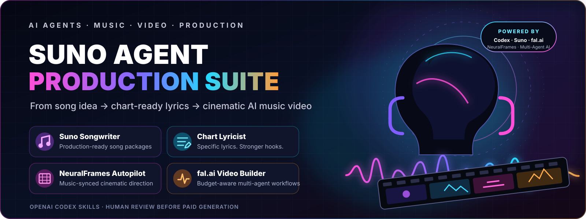
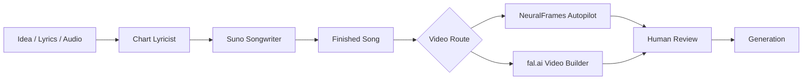

<p align="center">
  
</p>

<p align="center">
  <a href="#-suno-songwriter"></a>
  <a href="#-chart-lyricist"></a>
  <a href="#-neuralframes-autopilot"></a>
  <a href="#-falai-video-builder"></a>
</p>

<p align="center">
  <strong>WRITE → REFINE → DIRECT → BUILD</strong><br />
  <sub>Production-minded OpenAI Codex skills for creators who want stronger songs and coherent AI music videos—not generic one-shot prompts.</sub>
</p>

<p align="center">
  
  
  
  
</p>

---

## 🚀 What is this?

**Suno Agent Production Suite** is a four-skill AI music-production toolkit for OpenAI Codex-style agents. It can turn a raw song idea into a structured **Suno Custom package**, sharpen weak lyrics into more specific and singable writing, translate a finished track into a **NeuralFrames** visual concept, and architect a **budget-aware multi-agent fal.ai music-video workflow**.

> **In one sentence:** it gives an AI agent the operating procedures, creative standards, continuity rules, and validation tools needed to move from **song idea → finished prompt package → cinematic music-video plan** without pretending one giant prompt can do everything well.

### Built for

`songwriters` · `music producers` · `AI music creators` · `prompt engineers` · `video directors` · `Codex users` · `creative technologists`

---

## 🎛️ Pick your agent

<table>
<tr>
<td width="50%" valign="top">

### 🎵 Suno Songwriter
**Skill:** [`$suno-music`](skills/suno-music/)

Builds a production-ready Suno Custom package: title, exact style brief, exclusions, generation controls, and tagged lyrics.

**Use it when:** you have an idea, mood, genre fusion, reference traits, or draft lyrics and want a complete Suno-ready specification.

➡️ [Explore the skill](skills/suno-music/SKILL.md)

</td>
<td width="50%" valign="top">

### ✍️ Chart Lyricist
**Skill:** [`$chart-lyricist`](skills/chart-lyricist/)

Writes or rewrites lyrics for specificity, hook strength, prosody, dramatic escalation, and anti-cliche originality.

**Use it when:** the idea is good but the lyric feels generic, repetitive, over-written, or unmistakably AI-generated.

➡️ [Explore the skill](skills/chart-lyricist/SKILL.md)

</td>
</tr>
<tr>
<td width="50%" valign="top">

### 🎬 NeuralFrames Autopilot
**Skill:** [`$neuralframes-autopilot-video`](skills/neuralframes-autopilot-video/)

Turns a finished song into a cinematic three-act visual concept with continuity, musical sync, recurring motifs, and browser-ready Autopilot direction.

**Use it when:** you want a coherent music video concept without manually designing every shot.

➡️ [Explore the skill](skills/neuralframes-autopilot-video/SKILL.md)

</td>
<td width="50%" valign="top">

### ⚡ fal.ai Video Builder
**Skill:** [`$fal-music-video-builder`](skills/fal-music-video-builder/)

Runs a specialist-agent production pipeline for timing, story, visual world, continuity, shot design, model selection, cost control, and workflow validation.

**Use it when:** you need a serious end-to-end AI video plan where budget, duration, continuity, and model schemas actually matter.

➡️ [Explore the skill](skills/fal-music-video-builder/SKILL.md)

</td>
</tr>
</table>

---

## 🧠 Why not just use one prompt?

Because songwriting, lyric editing, visual direction, continuity, model selection, timing, and cost control are **different jobs**.

This suite behaves more like a small creative department:



### Production rules shared across the suite

- **Concrete contracts over vague prompting** — limits, timing, fields, handoffs, and validation are explicit.
- **Music-aware direction** — rhythm, harmony, instrumentation, vocal behavior, arrangement, dynamics, and mix all matter.
- **Originality over imitation** — references are translated into production traits rather than copied artist identities.
- **Continuity is tracked deliberately** — character, wardrobe, props, locations, palette, lighting, lenses, and texture stay coherent.
- **Cost is a production constraint** — the fal.ai pipeline reserves retry budget instead of spending everything on first-pass renders.
- **Human review comes before paid generation** — browser-assisted workflows stop at the final review boundary unless generation is explicitly authorized.

---

## 🎵 Suno Songwriter

The **Suno Songwriter** turns a concept into a strict six-field Suno Custom package.

### Output contract

| Field | Requirement |
|---|---|
| **Song Title** | Original, concise, tied to the central hook |
| **Style Description** | Exactly **1,000 characters**, one English paragraph |
| **Excluded Styles** | Negative prompt for unwanted genres, instruments, vocal traits, rhythms, or production flaws |
| **Weirdness** | `0–80` |
| **Style Influence** | `25–100` |
| **Tagged Lyrics** | Maximum **5,000 characters**, section/performance tags on dedicated lines |

The 1,000-character style description functions like a compressed producer brief: genre grammar, tempo/feel, rhythm, harmony, instrument roles, vocal identity, energy arc, production texture, and mix priorities.

### Deep references

- [`style-syntax.md`](skills/suno-music/references/style-syntax.md) — build the exact production brief.
- [`tag-corpus.md`](skills/suno-music/references/tag-corpus.md) — section, vocal, instrument, dynamics, meter, harmony, and sound-design cues.
- [`experimental-fusions.md`](skills/suno-music/references/experimental-fusions.md) — unusual hybrid production recipes.
- [`browser-workflow.md`](skills/suno-music/references/browser-workflow.md) — Suno Custom Mode browser procedure.
- [`research-notes.md`](skills/suno-music/references/research-notes.md) — provenance and evidence notes.

### Validate a package

```bash
python3 skills/suno-music/scripts/validate_song_package.py --help
```

### Prompt examples

```text
Use $suno-music to turn this concept into a complete Suno Custom song package.

Use $suno-music to build a sparse electronic slow-burner with a clear intro, escalation, and closing-card outro.

Use $suno-music to preserve these lyrics but completely redesign the production direction.
```

---

## ✍️ Chart Lyricist

The **Chart Lyricist** is the quality-control layer for words.

It begins with the dramatic situation—**who is singing, to whom, what they want, what blocks them, and what changes**—then builds a sensory bank before drafting. Every section must advance information, pressure, power, time, point of view, or consequence.

### What it actively looks for

- interchangeable AI imagery;
- empty emotional abstractions;
- hooks that could belong to any song;
- verse two restating verse one;
- predictable rhyme paths;
- filler phrases and vague pronouns;
- over-explanation;
- syllable stress that fights the melody;
- artist imitation disguised as “style.”

Its core rule is simple:

> **Replace the generic thought, not just the generic word.**

### Deep references

- [`workshop-craft.md`](skills/chart-lyricist/references/workshop-craft.md) — songwriting craft and revision methods.
- [`anti-cliche-standard.md`](skills/chart-lyricist/references/anti-cliche-standard.md) — hard failures and rewrite standards.
- [`production-tags.md`](skills/chart-lyricist/references/production-tags.md) — audible arrangement/performance tags.

### Lint lyrics

```bash
python3 skills/chart-lyricist/scripts/lyric_lint.py --help
```

### Prompt examples

```text
Use $chart-lyricist to rewrite these lyrics so they feel specific, human, and singable.

Keep the premise, but replace every generic image and make the hook impossible to swap into another song.

Build a slow-burn lyric where the second verse changes what the listener thinks is happening.
```

---

## 🎬 NeuralFrames Autopilot

The **NeuralFrames Autopilot Video** skill translates a finished song into a cinematic visual scaffold before generation credits are spent.

It establishes:

- a one-sentence visual thesis;
- a causal three-act arc;
- a protagonist, object, gesture, location, or metaphor that evolves;
- one unusual camera or art-direction rule;
- section-specific escalation tied to musical events;
- character, wardrobe, prop, palette, and location continuity;
- a final image that resolves or complicates the opening image;
- explicit negative constraints to control style drift.

The browser workflow can prepare Autopilot—audio, lyrics, aspect ratio, and visual direction—but stops at the final generation boundary unless the user explicitly approves spending credits.

### Reference

- [`current-ui-notes.md`](skills/neuralframes-autopilot-video/references/current-ui-notes.md) — current NeuralFrames operating notes.

### Prompt example

```text
Use $neuralframes-autopilot-video to turn this finished song into a cinematic three-act video concept. Preserve the approved character image and make every major visual change correspond to a musical event.
```

---

## ⚡ fal.ai Video Builder

The **fal.ai Music Video Builder** is the most technical skill in the suite. It treats an AI music video as an actual production pipeline rather than a collection of unrelated clips.

### The hard constraints

- measure source-audio duration instead of guessing;
- cover the entire track plus an intentional visual tail of roughly **2–5 seconds**;
- reserve **15–20%** of the hard generation budget for retries;
- verify current fal.ai schemas, supported durations, and pricing;
- disable unnecessary generated audio;
- keep identity, wardrobe, props, locations, and visual language coherent;
- validate the final plan and workflow before browser import;
- stop before paid generation.

### Multi-agent production pipeline

#### Wave 1 — understand the song and world

| Specialist | Owns | Artifact |
|---|---|---|
| **Audio Analyst** | duration, sections, tempo/meter, transitions, dynamics, lyrical turns | `song-map.json` |
| **Narrative Architect** | three-act premise, character change, motif, opening/final image | `story-bible.json` |
| **Visual-World Designer** | character IDs, wardrobe, props, locations, era, palette, lenses, texture | `continuity-bible.json` |

#### Wave 2 — edit and economics

| Specialist | Owns | Artifact |
|---|---|---|
| **Editorial Scene Planner** | exact in/out points, narrative purpose, sync moments, transitions | `scene-plan.json` |
| **Model & Budget Producer** | live models, schemas, pricing, clip durations, spend, retry reserve | `model-plan.json` + `live-schema-catalog.json` |
| **Continuity Editor** | identity drift, geography, wardrobe/prop errors, repeated framing | `continuity-audit.json` |

#### Wave 3 — design the shots

| Specialist | Owns | Artifact |
|---|---|---|
| **Shot Designer** | framing, lens, camera path, blocking, action, transition, musical cue | `shot-plan.json` |
| **Frame-Prompt Specialists** | canonical start/end frames and alternate angles | prompt artifacts |
| **Motion-Prompt Specialists** | achievable motion contracts for each shot | motion artifacts |

#### Wave 4 — assemble and audit

The **Workflow Architect** converts accepted artifacts into `production-plan.json` plus importable fal.ai workflow JSON.

Three independent audits must pass:

1. **Structure** — nodes, dependencies, references, schemas, outputs.
2. **Timing** — complete song coverage, supported clip durations, intentional transitions, correct tail.
3. **Cost & continuity** — spend + reserve, pricing evidence, retry count, identity/wardrobe/prop/location integrity.

### Validation

```bash
python3 skills/fal-music-video-builder/scripts/probe_audio.py /absolute/path/song.ext

python3 skills/fal-music-video-builder/scripts/validate_music_video.py \
  --plan /absolute/path/production-plan.json \
  --workflow /absolute/path/workflow.json \
  --schema-catalog /absolute/path/live-schema-catalog.json
```

### Deep references

- [`agent-production-pipeline.md`](skills/fal-music-video-builder/references/agent-production-pipeline.md)
- [`model-and-budget-policy.md`](skills/fal-music-video-builder/references/model-and-budget-policy.md)
- [`fal-workflow-contract.md`](skills/fal-music-video-builder/references/fal-workflow-contract.md)

---

## 🗂️ Repository map

```text
.
├── .codex-plugin/
│   └── plugin.json
├── assets/
│   ├── readme-hero.svg
│   ├── suno-icon.ico
│   └── suno-icon.png
└── skills/
    ├── chart-lyricist/
    │   ├── agents/openai.yaml
    │   ├── references/
    │   ├── scripts/lyric_lint.py
    │   └── SKILL.md
    ├── fal-music-video-builder/
    │   ├── agents/openai.yaml
    │   ├── references/
    │   ├── scripts/
    │   └── SKILL.md
    ├── neuralframes-autopilot-video/
    │   ├── agents/openai.yaml
    │   ├── references/current-ui-notes.md
    │   └── SKILL.md
    └── suno-music/
        ├── agents/openai.yaml
        ├── references/
        ├── scripts/validate_song_package.py
        └── SKILL.md
```

---

## 📦 Installation

```bash
git clone https://github.com/VagabondInc/suno-agent-production-suite.git
cd suno-agent-production-suite
```

The plugin entry point is:

```text
.codex-plugin/plugin.json
```

Individual skill contracts are located at:

```text
skills/<skill-name>/SKILL.md
```

> Host-specific skill/plugin installation can change. The repository is intentionally self-describing through its manifest instead of inventing a universal installer command.

---

## 💬 Try these first

```text
Write an experimental Suno song from this concept.

Rewrite these lyrics without generic AI tropes, but preserve the emotional premise.

Turn this finished track into a NeuralFrames Autopilot video concept.

Design a full fal.ai music-video workflow under a $40 hard generation budget.
```

---

## ❓ FAQ

### Can this generate Suno prompts and lyrics?

Yes. `$suno-music` creates a complete Suno Custom package including the exact style brief, excluded styles, generation controls, and tagged lyrics. `$chart-lyricist` can be used first when the writing itself needs deeper revision.

### Can it fix lyrics that sound obviously AI-generated?

That is a primary use case of `$chart-lyricist`. It specifically targets generic imagery, weak hooks, repetitive sections, predictable rhyme, filler, vague language, and synthetic-sounding emotional shorthand.

### Can it build a complete AI music video?

Yes, through two routes. `$neuralframes-autopilot-video` creates a cinematic Autopilot-ready concept. `$fal-music-video-builder` creates a more technical, budgeted, continuity-aware production workflow with specialist agents and validation.

### Does the fal.ai workflow actually account for cost?

Yes. It requires a hard budget, live model/schema evidence, and a reserved retry pool. A plan that spends the entire budget on first-pass generation fails the production contract.

### How does it keep characters consistent across AI video shots?

The fal.ai pipeline creates canonical continuity IDs for physical identity, wardrobe, props, locations, color palette, lighting, lenses, and texture. Scene, shot, frame, and motion prompts inherit those constraints.

### Does it imitate famous artists?

No. Named references are translated into higher-level musical or production characteristics—density, restraint, instrumentation, rhythmic placement, harmonic tension, vocal behavior, texture—rather than direct imitation.

### Does it automatically spend credits?

No. Browser-assisted workflows are designed to prepare the project and stop at the paid-generation boundary unless generation is explicitly authorized.

### Is this an official Suno, NeuralFrames, fal.ai, or OpenAI project?

No. This is an independent creator/developer toolkit. Product names are used descriptively to identify compatible services and workflows.

---

## 🔎 Search & discovery

Relevant topics include **Suno AI prompts**, **Suno songwriting agent**, **Suno Custom Mode prompt generator**, **AI lyric writer**, **AI songwriting workflow**, **OpenAI Codex skills**, **Codex music agent**, **AI music production agent**, **NeuralFrames Autopilot workflow**, **AI music video generator**, **fal.ai workflow**, **fal.ai music video**, **character-consistent AI video**, **multi-agent video production**, **AI video prompt engineering**, and **budget-aware generative video**.

---

## 👤 Author

**Justin Tyler Moore**

## ⚖️ License

No license file is included in the current package. Until one is added, standard copyright rules apply; public visibility on GitHub does not itself grant reuse rights.

## ™️ Trademark notice

Suno, NeuralFrames, fal.ai, OpenAI, Codex, and other referenced product names may be trademarks of their respective owners. This repository is independent and is not presented as an official or endorsed project of those companies.
